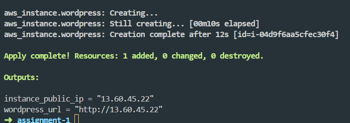
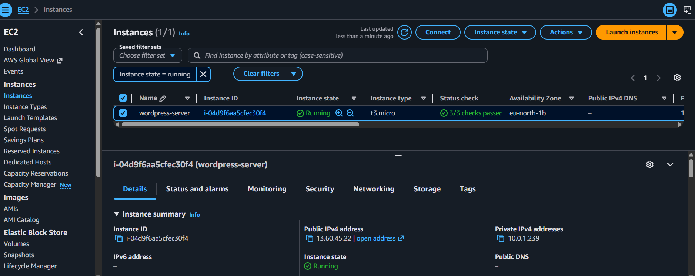
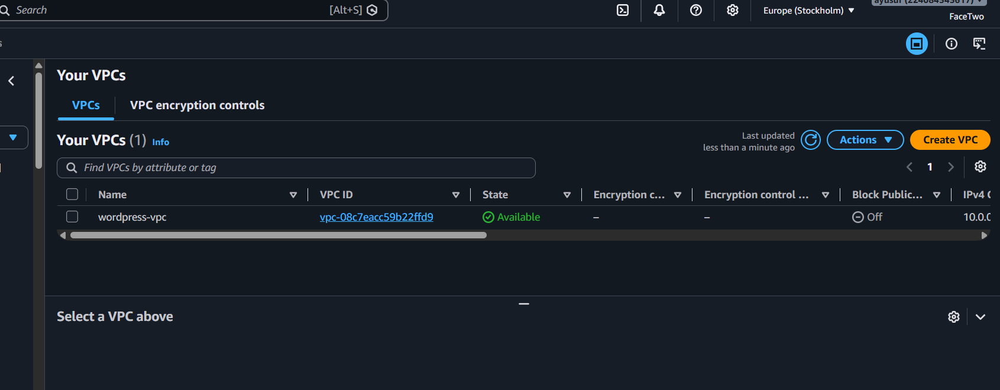
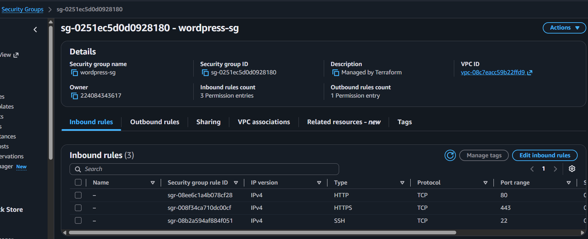
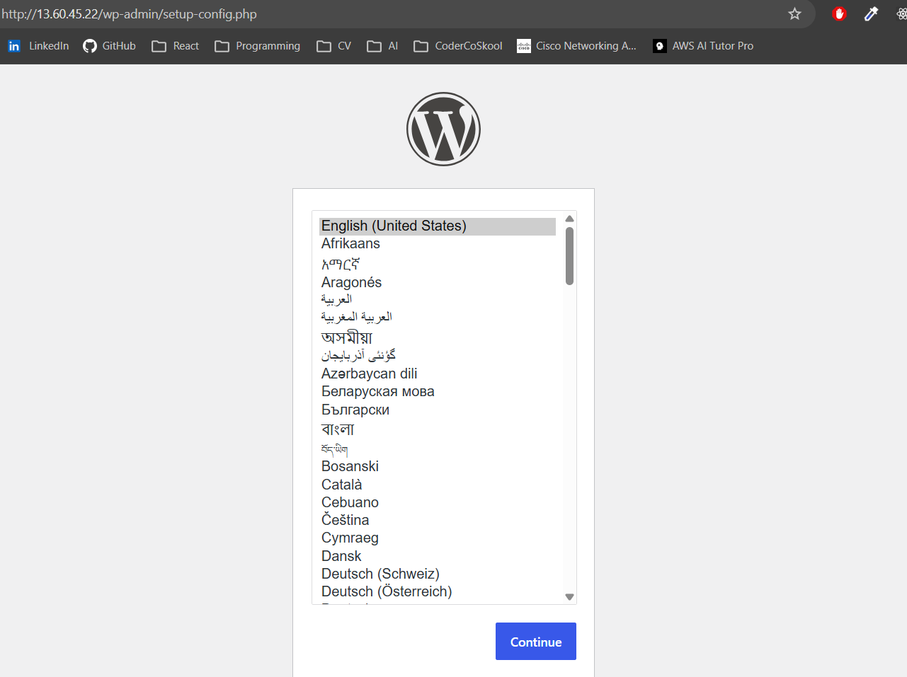
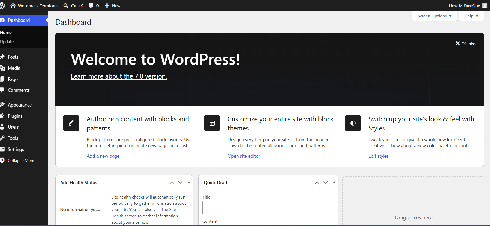

# Assignment 1 – Deploy WordPress Using Terraform

## Project Overview

This project demonstrates how to use **Terraform** to provision a complete WordPress environment on AWS.

The infrastructure is fully automated using Terraform and includes:

* Custom VPC
* Public Subnet
* Internet Gateway
* Route Table and Route Table Association
* Security Group
* EC2 Instance
* Apache Web Server
* PHP
* MariaDB
* WordPress installation using a user data script

---

## Objective

Deploy a complete WordPress stack on AWS using Terraform.

The deployment includes:

* EC2 instance running WordPress
* Security Group
* User data script for automatic software installation
* Public endpoint
* Infrastructure managed entirely with Terraform

---

## Architecture

```text
                         Internet
                            │
                    ┌───────▼────────┐
                    │ Internet       │
                    │ Gateway (IGW)  │
                    └───────┬────────┘
                            │
                    ┌───────▼────────┐
                    │  Route Table   │
                    │  0.0.0.0/0 →   │
                    │     IGW        │
                    └───────┬────────┘
                            │
                    ┌───────▼────────┐
                    │  Public Subnet │
                    │  (e.g. /24)    │
                    └───────┬────────┘
                            │
                    ┌───────▼────────────────────┐
                    │        EC2 Instance         │
                    │  ┌─────────────────────┐   │
                    │  │  Apache (HTTP/HTTPS) │   │
                    │  │  PHP                │   │
                    │  │  MariaDB            │   │
                    │  │  WordPress          │   │
                    │  └─────────────────────┘   │
                    └───────┬────────────────────┘
                            │
                    ┌───────▼────────────────────┐
                    │      Security Group         │
                    │  • Port 22   — SSH          │
                    │  • Port 80   — HTTP         │
                    │  • Port 443  — HTTPS        │
                    └────────────────────────────┘
```
---

## Prerequisites

Before deploying, install:

* Terraform
* AWS CLI
* AWS Account
* Configured AWS credentials

Verify installations:

```bash
terraform version
aws --version
```

---

## Deployment Steps

Initialize Terraform:

```bash
terraform init
```

Review the execution plan:

```bash
terraform plan
```

Deploy the infrastructure:

```bash
terraform apply
```

Destroy the infrastructure when finished:

```bash
terraform destroy
```

---

## Files

### main.tf

Defines all AWS resources including:

* VPC
* Subnet
* Internet Gateway
* Route Table
* Security Group
* EC2 Instance

### provider.tf

Configures the AWS provider.

### versions.tf

Defines the Terraform and provider versions.

### variables.tf

Contains input variables such as:

* AWS Region
* Instance Type
* Key Pair (optional)

### outputs.tf

Displays useful outputs including:

* EC2 Public IP
* WordPress URL

### userdata.sh

Automatically installs:

* Apache
* PHP
* MariaDB
* WordPress

during EC2 instance creation.

---

## Terraform Resources Created

* AWS VPC
* Internet Gateway
* Public Subnet
* Route Table
* Route Table Association
* Security Group
* Ubuntu EC2 Instance

---

## WordPress Configuration

Database Name:

```
wordpress
```

Username:

```
wpuser
```

Password:

```
wppassword
```

Database Host:

```
localhost
```

Table Prefix:

```
wp_
```

---

## Outputs

After a successful deployment Terraform displays:

```text
instance_public_ip = "<EC2 Public IP>"
wordpress_url = "http://<EC2 Public IP>"
```

Example:

```
instance_public_ip = "13.60.xx.xx"
wordpress_url = "http://13.60.xx.xx"
```

---

## Screenshots

### Terraform Apply



### EC2 Instance



### VPC



### Security Group



### WordPress Installation



### WordPress Dashboard



---

## Skills Demonstrated

* Infrastructure as Code (IaC)
* Terraform
* AWS EC2
* AWS VPC
* AWS Networking
* Security Groups
* Linux User Data
* Apache Web Server
* PHP
* MariaDB
* WordPress Deployment
* Infrastructure Automation

---

## Cleanup

To remove all resources:

```bash
terraform destroy
```

---

DevOps WordPress Using Terraform on AWS.
